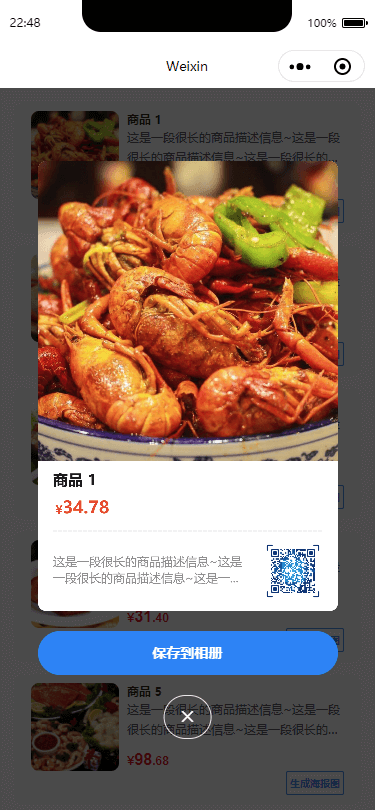

## 简介

<div align="center">
    <h1>wx-canvas-2d</h1>
    <p>微信小程序 canvas-2d 绘图工具，支持按需加载，支持内容配置，支持功能扩展。</p>
    <p>适配各种机型，超轻量，超易用，无需学习，直接上手。</p>
</div>
<br />
<div align="center">
    
    
    
    
</div>
<br />

<div align="center">
    
</div>

## 安装

*****
```shell
npm i -S wx-canvas-2d
```

::: tip 提示
安装完毕后记得用微信小程序开发者工具构建一下npm (工具 -> 构建 npm)
:::


## 快速开始

*****

第一步，在 `wxml` 文件中写入 `canvas` 元素

```html
<view class="canvas-container">
    <canvas
        type="2d"
        id="poster-canvas"
        class="poster-canvas"
        style="width: 100%; height: 100%;"
        disable-scroll="{{ true }}"
    />
</view >
```

第二步，为 `canvas` 元素容器设置大小
```css
.canvas-container {
    width: 600rpx;
    height: 900rpx;
}
```

第三步，在 `js` 文件中引入 `wx-canvas-2d` 插件，然后实例化 `WxCanvas2d` 对象，并创建画布

```js
// 引入 `wx-canvas-2d` 插件
import WxCanvas2d from 'wx-canvas-2d'

// 实例化对象
const canvas = new WxCanvas2d()

// 创建画布
canvas.create({
    query: '.poster-canvas', // 必传，canvas元素的查询条件
    rootWidth: 750, // 参考设备宽度 (即开发时UI设计稿的宽度，默认375，可改为750)
    bgColor: '#fff', // 背景色，默认透明
    component: this, // 自定义组件内需要传 this
    radius: 16 // 海报图圆角，如果不需要可不填
}).then(res => {
    // console.log(res)
}).catch(err => {
    console.log('[WxCanvas2d] Canvas create fail: ', err)
})
```

第四步，画布创建后就可以开始绘制了

```js
canvas.draw({
    series: [
        {
            type: 'text',
            text: 'Hello World',
            fontSize: 30
        }
    ]
})
```

效果图：

